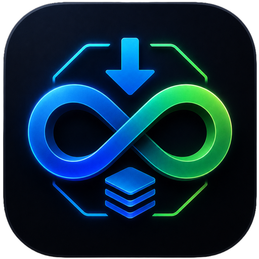

<div align="center">
  
  <h1>Arr Health Dashboard</h1>
  <p><strong>Eén rustige plek om te zien of je volledige mediaketen gezond is.</strong></p>
  <p>Sonarr · Radarr · InfiniDysk · WebDAV · Bazarr · Plex · Docker</p>

  
  
  
  
</div>

---

Arr Health is een privacyvriendelijk monitoringdashboard voor een self-hosted mediastack. Het combineert live API-controles, Dockerstatus, read-only mounttests en bestaande logs tot één menselijk antwoord:

> Is de keten gezond, waar ontstaat een probleem en moet ik nu iets doen?

Het dashboard draait volledig lokaal, gebruikt geen externe assets of chart-library en bewaart geen mediatitels in zijn metriekhistorie.

## Een dashboard dat helpt beslissen


Bovenaan staan maximaal zeven hoofdkaarten. Ze beantwoorden direct:

- **Algemene status** — gezond, degraded, incident of onbekend.
- **Actieve problemen** — alleen problemen die nu nog relevant zijn.
- **Queues** — normale downloads zijn blauw; alleen stalled of failed items vragen aandacht.
- **Automatisch herstel** — geslaagde repairs blijven zichtbaar als positief automationresultaat.
- **Providers** — providertrips en missing-article-signalen uit echte logs.
- **WebDAV-mount** — read-only beschikbaarheid en gemeten latency.
- **Trend** — beter of slechter dan de vorige periode.

## Dark mode die ook echt rustig blijft


Light, dark en system/auto gebruiken dezelfde semantische statuskleuren. De handmatige keuze wordt lokaal onthouden en de pagina volgt bij een eerste bezoek automatisch het systeemthema, zonder zichtbare theme-flash.

| Kleur | Betekenis | Voorbeeld |
| --- | --- | --- |
| 🟢 Groen | Gezond of succesvol opgelost | Mount leesbaar, cutoff unmet = 0 |
| 🔵 Blauw | Normale activiteit | Actieve download of import |
| 🟡 Geel | Aandacht nodig | Queue-item tijdelijk zonder voortgang |
| 🔴 Rood | Actuele verstoring | API onbereikbaar, failed import, stale mount |
| ⚪ Grijs | Onvoldoende betrouwbare data | Provider nog niet in logs gezien |

## De hele mediaketen in beeld

```text
Sonarr / Radarr
       ↓
search / indexer → Usenet-provider → InfiniDysk → WebDAV-mount
                                                   ↓
                                      import / library → Plex / Bazarr
```

Per betrouwbaar controleerbaar onderdeel toont het dashboard bereikbaarheid, responstijd, laatste succesvolle controle en het actieve probleem. Hierdoor is niet alleen zichtbaar dát iets stuk is, maar ook waar de verstoring begint en welk vervolgonderdeel geraakt kan zijn.

## Belangrijkste mogelijkheden

### Incidenten met een levenscyclus

Logsignalen krijgen een stabiele fingerprint, categorie, severity, first/last seen, telling en advies. Een oude foutregel blijft niet eindeloos rood:

- provider- en mountsignalen verlopen na 1 uur;
- importproblemen na 2 uur;
- missing/corrupt-signalen na 6 uur;
- replacement-limits na 12 uur;
- succesvolle repair- en fallback-events zijn direct opgelost.

Regels zonder betrouwbare timestamp worden veilig als historisch behandeld.

### Queue-aging in plaats van “queue = fout”

Een niet-lege queue is normale activiteit. Arr Health onderscheidt actief downloaden, tijdelijk geen voortgang, langdurig stalled en expliciete importfouten. Waar de brondata dit ondersteunt worden voortgang, resterende grootte, ETA en leeftijd getoond. Problematische en oudste items komen bovenaan.

### Read-only mountcontrole

De tv-, movie- en InfiniDysk-paden krijgen een echte directory-read met harde timeout. De controle schrijft nooit naar de media-mount en onderscheidt gezond, traag, time-out en ontbrekend.

### Privacyvriendelijke historie

`metrics-history.json` bevat alleen operationele totalen en statussen: queues, wanted/cutoff, incidentcategorieën, repairs, mountlatency, API-responstijden en containerstatus. Writes zijn geserialiseerd en atomair. Standaard wordt iedere vijf minuten gemeten met 90 dagen begrensde retentie. Een ontbrekend of beschadigd bestand laat het dashboard niet crashen.

## Techniek

```text
Browser
  └── static HTML / CSS / JavaScript
          │
          ▼
     Node.js 20 server
       ├── Sonarr / Radarr API
       ├── InfiniDysk queue en logs
       ├── Bazarr providers
       ├── Docker socket
       └── read-only mounts en logs
```

- Dependency-free Node.js 20-runtime.
- Geen database of buildstap nodig.
- Geen externe fonts, CDN’s of runtime-internetafhankelijkheid.
- Eén onbereikbare bron breekt de rest van het dashboard niet.
- Responsive, toetsenbordtoegankelijk en reduced-motion-vriendelijk.
- CSS/SVG-sparklines zonder zware chart-library.

## Lokaal starten

1. Kopieer de veilige voorbeeldconfiguratie:

   ```bash
   cp config.example.json config.json
   ```

2. Vul lokaal de API-keys en service-URL’s in. Commit `config.json` nooit.

3. Start met Node.js 20 of nieuwer:

   ```bash
   npm start
   ```

4. Open [http://localhost:8090](http://localhost:8090).

Tests uitvoeren:

```bash
npm test
```

## Unraid-deployment

De meegeleverde template staat in [`unraid/my-arr-health-dashboard.xml`](unraid/my-arr-health-dashboard.xml). De frontend is geen GitHub Pages-site: de Node-server communiceert met LAN-only services en mounted logs.

| Containerpad | Doel | Modus |
| --- | --- | --- |
| `/app` | Applicatie, configuratie, historie en actions | read/write |
| `/data` | Logs van de mediastack | read-only |
| `/symlinks` | Tv- en moviepaden | read-only |
| `/nzbdav` | WebDAV/InfiniDysk mount | read-only |
| `/var/run/docker.sock` | Containerstatus en allowlisted restarts | bindmount |

## Veilige beheeracties

Handmatige acties staan bewust onder een ingeklapt beheerblok. De backend accepteert alleen expliciet toegestane Arr-commands, host-actions en containers. Gelijktijdige acties worden geweigerd en cross-origin action requests worden geblokkeerd.

> [!IMPORTANT]
> Een read-only bindmount van de Docker-socket maakt de Docker API niet read-only. Houd het dashboard op een vertrouwd LAN en plaats er authenticatie via een reverse proxy voor wanneer het breder bereikbaar is.

## Repository-indeling

```text
server.js                 API-aggregatie, historie en veilige acties
lib/telemetry.js          status-, queue-, incident- en trendlogica
public/index.html         semantische dashboardstructuur
public/app.js             rendering en interactie
public/styles.css         responsive light/dark designsysteem
test/telemetry.test.js    gerichte status- en regressietests
config.example.json       veilige configuratietemplate
unraid/                   Unraid Docker-template
docs/                     README-screenshots
```

## Privacy

Commit nooit `config.json`, API-keys, dashboardexports, interne snapshots, volledige logs, media- of releasetitles en runtimehistorie. Deze bestanden zijn uitgesloten via `.gitignore`.
