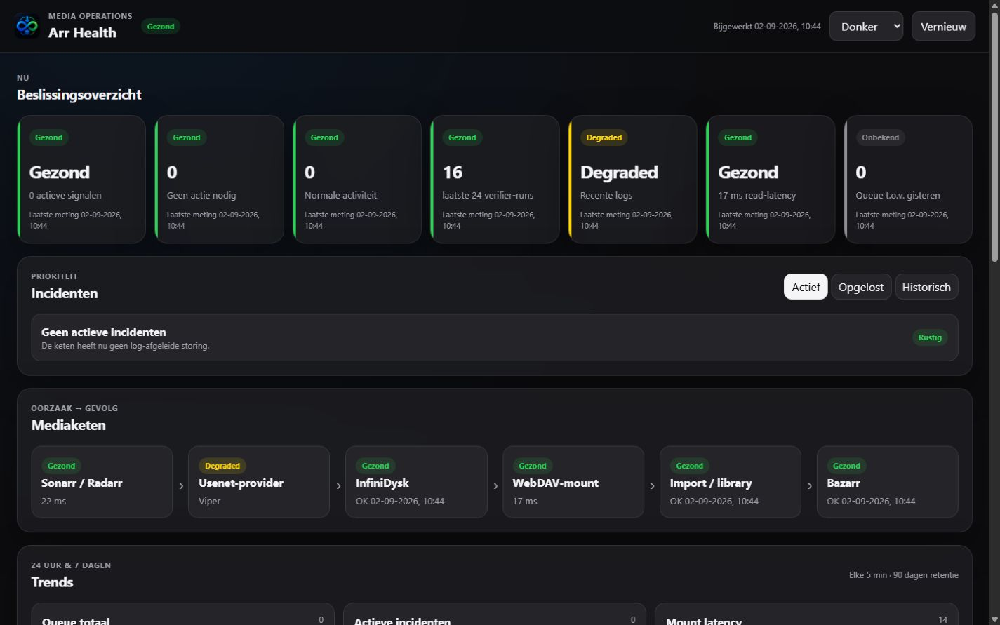
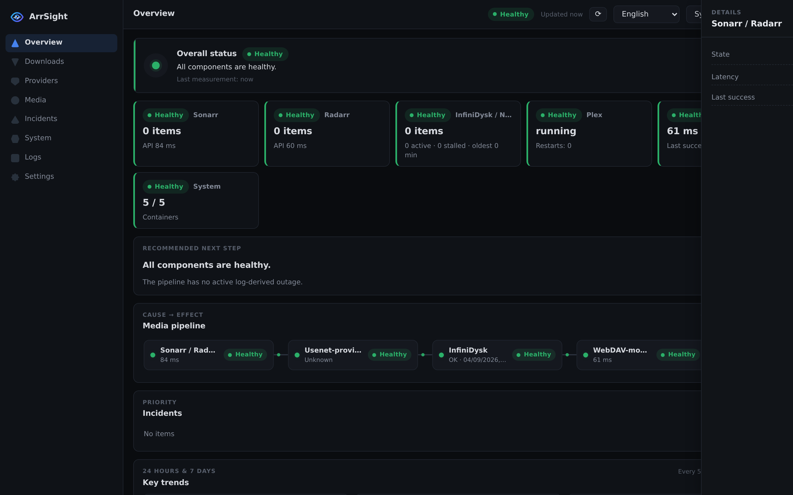
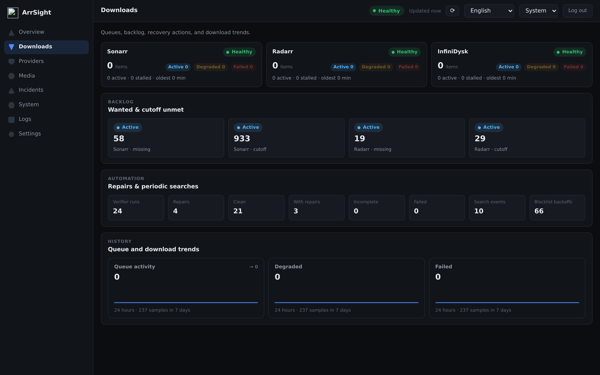
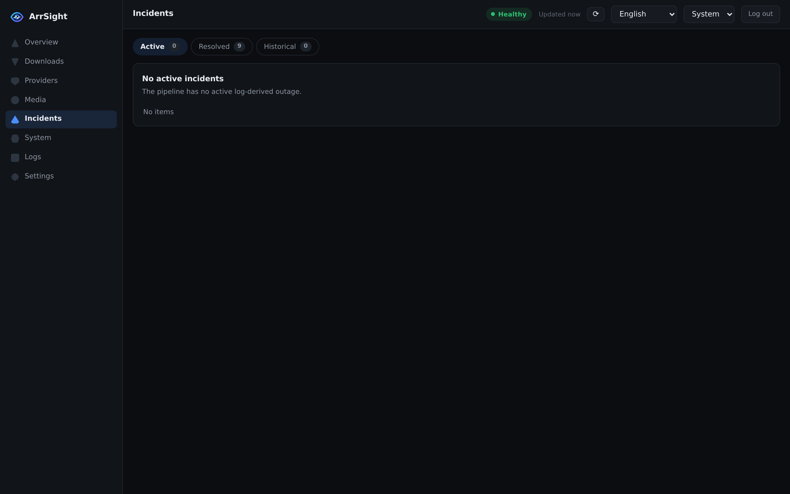
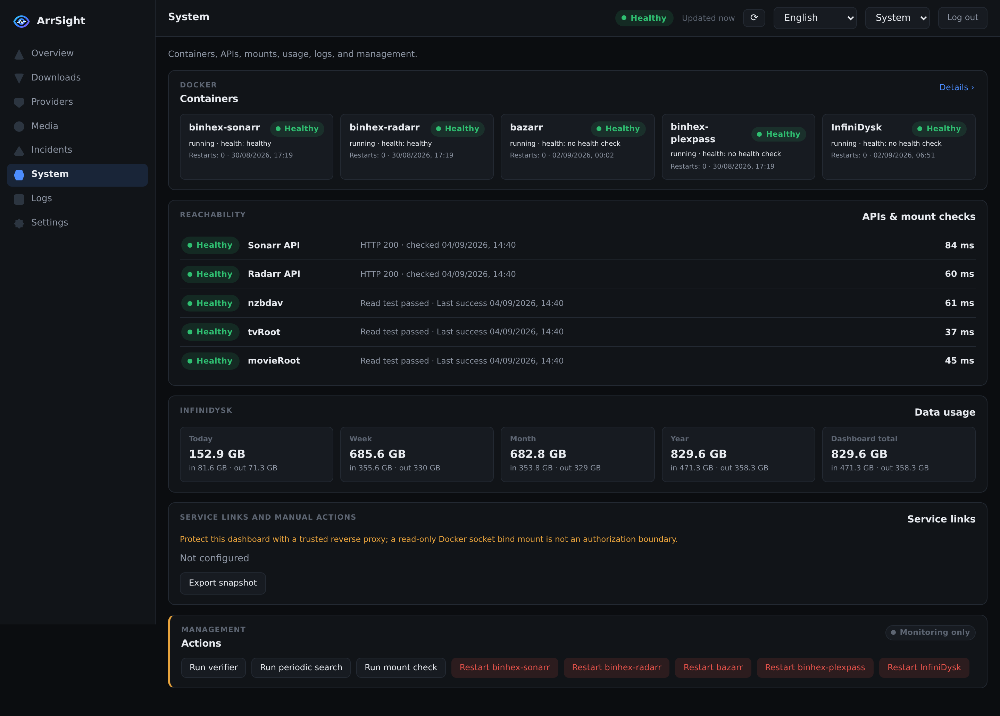
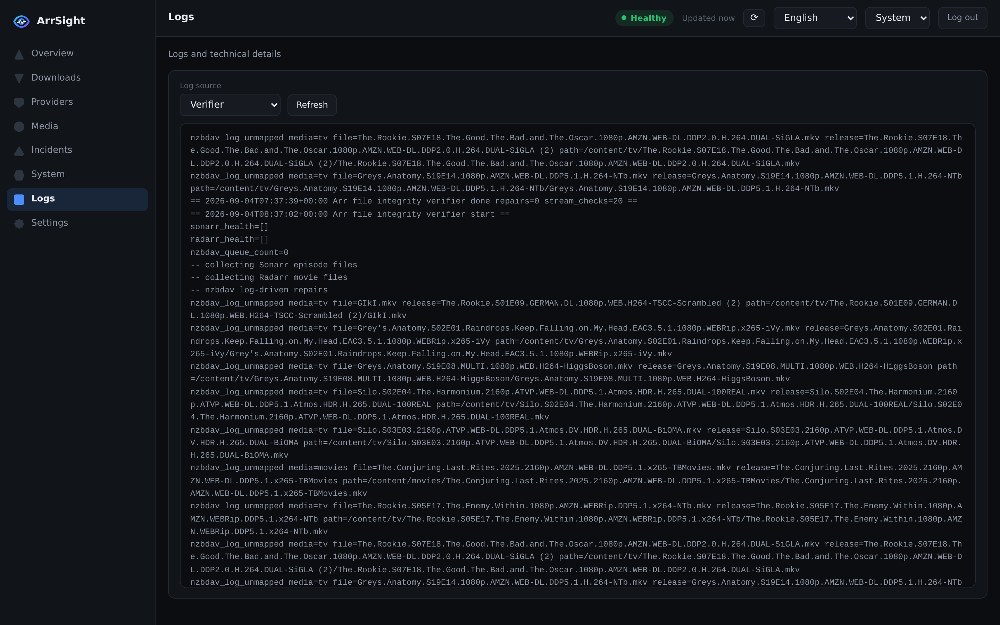
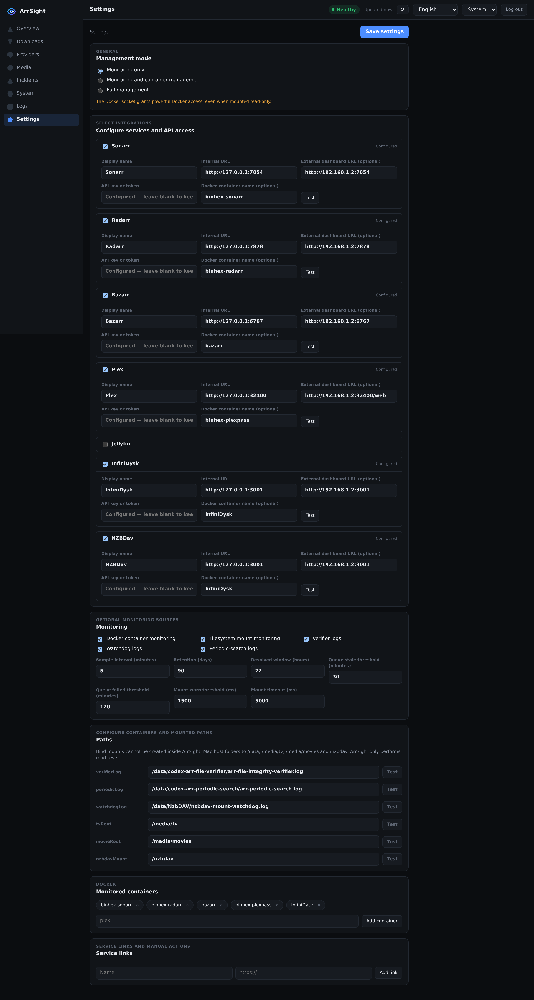
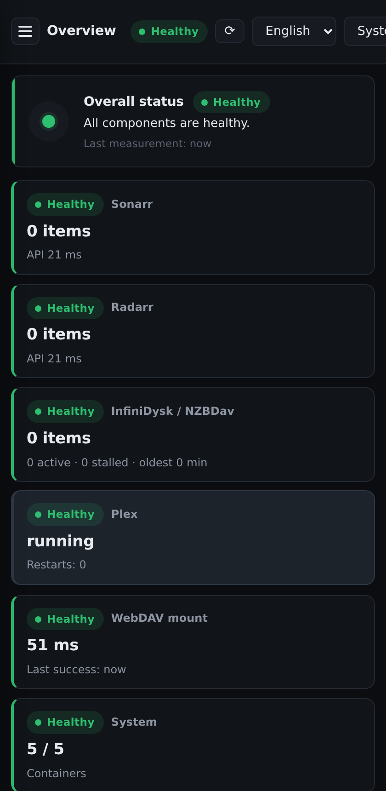

<div align="center"><p><strong>Media stack health, at a glance.</strong></p></div>

ArrSight is a self-hosted monitoring and operations dashboard for the *Arr media stack, Usenet, InfiniDysk/NZBDav, Plex/Jellyfin and Docker. It combines live service checks, Docker state, read-only mount tests, and operational logs into one calm, dark-first interface: a sidebar app shell, an interactive media pipeline, click-through detail drawers, a multi-source log viewer, and an incidents workflow. The responsive interface supports English and Dutch, light and dark themes, keyboard navigation, and translated accessibility labels.



## Screenshots

| | |
|---|---|
|  |  |
|  |  |
|  |  |
|  |  |

The guided first-run setup is shown in [setup-wizard.png](docs/setup-wizard.png).

## What it does

- **Overview** — overall health (healthy / degraded / incident / unknown), status cards for Sonarr, Radarr, InfiniDysk/NZBDav, Plex/Jellyfin, the WebDAV mount and Docker, a recommended next step, and an interactive **media pipeline** (Arr → Usenet provider → InfiniDysk → WebDAV mount → import/library → Bazarr → Plex) whose connections turn amber or red when data stops flowing.
- **Downloads** — Sonarr/Radarr/InfiniDysk queues with stalled and failed classification, wanted and cutoff-unmet backlog, integrity-verifier and periodic-search summaries, and 24-hour trends.
- **Providers** — Usenet provider trips, timeouts and missing-article signals derived from labelled log events, plus recovery history and trends.
- **Media** — Bazarr, Plex/Jellyfin and playback/library health.
- **Incidents** — active, recently resolved and historical incidents with severity, source, first/last seen, occurrence count and advice.
- **System** — containers with restart counts, API latency, mount read tests with latency history, network usage per day/week/month/year, service links and management actions.
- **Logs** — six log sources (verifier, periodic search, watchdog, actions, InfiniDysk, Bazarr) in one viewer with severity highlighting.
- **Settings** — full configuration UI with connection and path tests; on first launch the same UI becomes the setup wizard.

Clicking any card, pipeline stage or incident opens a slide-in detail drawer (keyboard accessible, closes with `Escape`). Data refreshes automatically every 60 seconds, or on demand via the refresh button.

## Integrations

Sonarr, Radarr, Bazarr, Plex, Jellyfin, InfiniDysk, NZBDav, Docker container monitoring, WebDAV/filesystem mounts, verifier logs, watchdog logs, and periodic-search logs are independently optional.

## Docker installation

```bash
docker run -d \
  --name arrsight \
  --restart unless-stopped \
  -p 8090:8090 \
  -e CONFIG_DIR=/config \
  -e PUID=1000 -e PGID=1000 -e UMASK=0022 \
  -v /path/to/arrsight:/config \
  -v /path/to/logs:/data:ro \
  -v /path/to/tv:/media/tv:ro \
  -v /path/to/movies:/media/movies:ro \
  -v /path/to/nzbdav:/nzbdav:ro \
  ghcr.io/cyxno/arrsight:latest
```

Only when Docker monitoring or management is enabled, add `-v /var/run/docker.sock:/var/run/docker.sock:ro`. The socket grants powerful control over Docker even with a read-only bind option. Monitoring-only mode is the safe default and permits no container or host actions.

Open `http://HOST:8090`. On first launch ArrSight shows the guided setup wizard in the app and prints a one-time, 30-minute setup code to the container log (`docker logs arrsight`). Setup also creates an administrator password using Node.js `scrypt`; only its salted hash is stored. After setup, dashboard data (`/api/snapshot`, `/api/logs`) and settings require an expiring HttpOnly, SameSite session; `/api/health` stays open. When a reverse proxy terminates HTTPS, set the environment variable `ARRSIGHT_TRUST_PROXY=true` and ArrSight marks the session cookie `Secure` based on an `X-Forwarded-Proto: https` request header; without that variable the header is ignored, so direct local HTTP installations stay safe by default. Secrets use password fields, are stored with mode `0600`, and are never returned by configuration APIs.

`PUID`, `PGID`, and `UMASK` control the non-root runtime identity and created-file permissions. The entrypoint prepares only `/config`; it never recursively changes media/log mounts or changes Docker-socket permissions. When present, the socket group is added as a supplementary group. Unraid defaults are `PUID=99`, `PGID=100`, and `UMASK=0022`.

## Configuration and migration

Runtime files live under `CONFIG_DIR` (`/config` in Docker): `config.json`, metrics, incidents, usage history, and `actions/`. Precedence is built-in safe defaults, the existing configuration file, then supported environment overrides (`CONFIG_DIR`). Version-1 configurations are migrated to schema version 2 in memory. On Docker upgrades, legacy runtime files in `/app` are copied once when their `/config` destination does not exist; the migration is idempotent and never overwrites data.

Use the Settings page to sign in, revisit setup, replace secrets, change URLs and paths, run service-specific authenticated connection tests, or select one of these modes:

- Monitoring only: no management operations; Docker socket optional for status monitoring.
- Monitoring and container management: socket required; operations remain limited to configured containers.
- Full management: explicitly permits predefined host actions; arbitrary commands are never accepted.

Back up `/config` before updates. Pull and recreate the container to update. Existing configuration remains compatible.

## Unraid and GHCR

Import `unraid/my-arr-health-dashboard.xml`, review the optional mounts, start the container, then retrieve the setup code from its log. Images on GHCR inherit the visibility of their package settings; if the package is private, Unraid needs credentials to pull — after the first publication, package visibility can be changed to public (Package settings → Danger Zone) so it can be pulled anonymously.

Images publish as `ghcr.io/cyxno/arrsight:latest`, semantic-version tags, and commit-SHA tags for AMD64 and ARM64 after syntax checks, the frontend build and tests pass. Pull requests validate and build without publishing.

## Security and privacy

Keep ArrSight behind a trusted network or authenticated reverse proxy. Setup and settings writes enforce same-origin requests, allowlisted fields, URL/schema validation, normalized mount categories, atomic writes, secret redaction, and predefined actions. ArrSight has no CDN, analytics, external font, or telemetry. Snapshots and histories do not persist API keys, media titles, or log contents.

**Docker socket:** mounting `/var/run/docker.sock` grants powerful, effectively root-equivalent access to the host — even when bound read-only. ArrSight itself only issues container inspect calls and restarts for explicitly allowlisted containers (management modes only), but anyone who gains ArrSight admin access while the socket is mounted has that reach. Do not mount the socket unless you need container monitoring or management, and never expose the dashboard to the internet without an authenticated proxy in front of it. See [SECURITY.md](SECURITY.md) for reporting and deployment expectations.

**Reverse proxy / HTTPS:** ArrSight speaks plain HTTP and has no TLS of its own. Terminate HTTPS on a trusted reverse proxy and set `ARRSIGHT_TRUST_PROXY=true` so session cookies are marked `Secure`; without that variable forwarded headers are ignored, keeping direct LAN installs safe by default.

## Troubleshooting

- **First-run setup code** — printed to the container log for 30 minutes: `docker logs arrsight`. It disappears once setup completes; restart the container to get a new one if it expires.
- **401 after setup** — expected: the dashboard requires the administrator login once configured.
- **Mount checks failing** — verify the host folders are actually mounted into the container at `/media/tv`, `/media/movies` and `/nzbdav`, and that the files are readable by the container user (`PUID`/`PGID`).
- **Cookie loops behind a proxy** — set `ARRSIGHT_TRUST_PROXY=true` on the container and make sure the proxy forwards `X-Forwarded-Proto`.
- **No container data** — Docker monitoring needs the socket mounted and containers listed in Settings → Monitored containers.

## License

[MIT](LICENSE)

## Development

Requires Node.js 20 or newer. The frontend is a Svelte 5 + Vite 6 single-page app in `frontend/`; its production build is served by the Node server from `public/`.

```bash
# backend + cross-cutting tests (also exercises frontend logic modules)
npm test

# frontend build (CI runs this before the test suite)
cd frontend && npm ci && npm run build

# syntax checks
node --check server.js && node --check lib/telemetry.js

# container (multi-stage: builds the frontend, then the small Node runtime)
docker build -t arrsight:test .
```

During frontend development, `cd frontend && npm run dev` proxies `/api` to a local server on port 8090.

Brand PNGs are reproducibly rendered from `public/favicon.svg` with `npm install --no-save sharp && node scripts/render-icons.cjs`; Sharp is not a runtime dependency.
