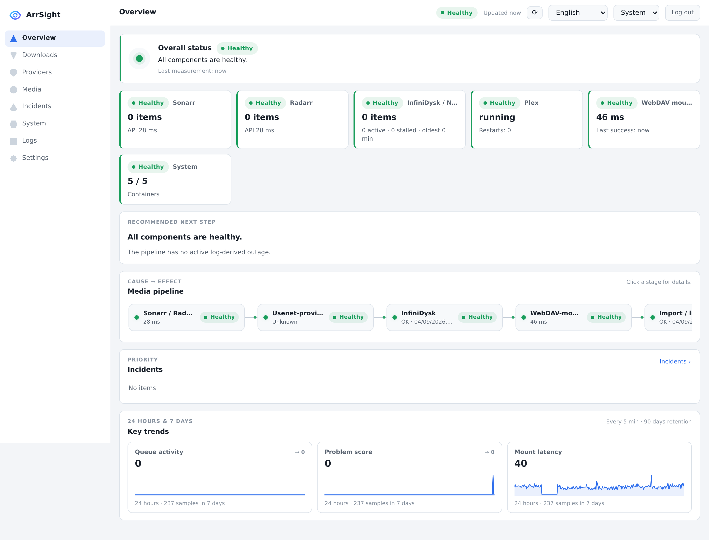

<div align="center"><p><strong>Media stack health, at a glance.</strong></p></div>

ArrSight is a private, dependency-light dashboard for a self-hosted media stack. It combines live service checks, Docker state, read-only mount tests, and operational logs. The responsive interface supports English and Dutch, light and dark themes, keyboard navigation, and translated accessibility labels.



Dark mode and the guided first-run setup are documented in [dashboard-dark.png](docs/dashboard-dark.png) and [setup-wizard.png](docs/setup-wizard.png).

## Integrations

Sonarr, Radarr, Bazarr, Plex, Jellyfin, InfiniDysk, NZBDav, Docker container monitoring, WebDAV/filesystem mounts, verifier logs, watchdog logs, and periodic-search logs are independently optional.

## Docker installation

```bash
docker run -d \
  --name arrsight \
  --restart unless-stopped \
  -p 8090:8090 \
  -e CONFIG_DIR=/config \
  -e PUID=1000 -e PGID=1000 -e UMASK=0022 \
  -v /path/to/arrsight:/config \
  -v /path/to/logs:/data:ro \
  -v /path/to/tv:/media/tv:ro \
  -v /path/to/movies:/media/movies:ro \
  -v /path/to/nzbdav:/nzbdav:ro \
  ghcr.io/cyxno/arrsight:latest
```

Only when Docker monitoring or management is enabled, add `-v /var/run/docker.sock:/var/run/docker.sock:ro`. The socket grants powerful control over Docker even with a read-only bind option. Monitoring-only mode is the safe default and permits no container or host actions.

Open `http://HOST:8090`. On first launch ArrSight redirects to `/setup` and prints a one-time, 30-minute setup code to the container log (`docker logs arrsight`). Setup also creates an administrator password using Node.js `scrypt`; only its salted hash is stored. After setup, dashboard data (`/api/snapshot`, `/api/logs`) and settings require an expiring HttpOnly, SameSite session; `/api/health` stays open. When a reverse proxy terminates HTTPS, set the environment variable `ARRSIGHT_TRUST_PROXY=true` and ArrSight marks the session cookie `Secure` based on an `X-Forwarded-Proto: https` request header; without that variable the header is ignored, so direct local HTTP installations stay safe by default. Secrets use password fields, are stored with mode `0600`, and are never returned by configuration APIs.

`PUID`, `PGID`, and `UMASK` control the non-root runtime identity and created-file permissions. The entrypoint prepares only `/config`; it never recursively changes media/log mounts or changes Docker-socket permissions. When present, the socket group is added as a supplementary group. Unraid defaults are `PUID=99`, `PGID=100`, and `UMASK=0022`.

## Configuration and migration

Runtime files live under `CONFIG_DIR` (`/config` in Docker): `config.json`, metrics, incidents, usage history, and `actions/`. Precedence is built-in safe defaults, the existing configuration file, then supported environment overrides (`CONFIG_DIR`). Version-1 configurations are migrated to schema version 2 in memory. On Docker upgrades, legacy runtime files in `/app` are copied once when their `/config` destination does not exist; the migration is idempotent and never overwrites data.

Use the System → Settings section to sign in, revisit setup, replace secrets, change URLs and paths, run service-specific authenticated connection tests, or select one of these modes:

- Monitoring only: no management operations; Docker socket optional for status monitoring.
- Monitoring and container management: socket required; operations remain limited to configured containers.
- Full management: explicitly permits predefined host actions; arbitrary commands are never accepted.

Back up `/config` before updates. Pull and recreate the container to update. Existing configuration remains compatible.

## Unraid and GHCR

Import `unraid/my-arr-health-dashboard.xml`, review the optional mounts, start the container, then retrieve the setup code from its log. GHCR packages from a private repository require authentication; after the first publication, package visibility may need to be changed to public manually before Unraid can pull anonymously.

Images publish as `ghcr.io/cyxno/arrsight:latest`, semantic-version tags, and commit-SHA tags for AMD64 and ARM64 after syntax checks and tests pass. Pull requests validate and build without publishing.

## Security and privacy

Keep ArrSight behind a trusted network or authenticated reverse proxy. Setup and settings writes enforce same-origin requests, allowlisted fields, URL/schema validation, normalized mount categories, atomic writes, secret redaction, and predefined actions. ArrSight has no CDN, analytics, external font, or telemetry. Snapshots and histories do not persist API keys, media titles, or log contents.

## Development

Requires Node.js 20 or newer.

```bash
npm test
node --check server.js
node --check lib/telemetry.js
docker build -t arrsight:test .
```

Brand PNGs are reproducibly rendered from `public/favicon.svg` with `npm install --no-save sharp && node scripts/render-icons.cjs`; Sharp is not a runtime dependency.
