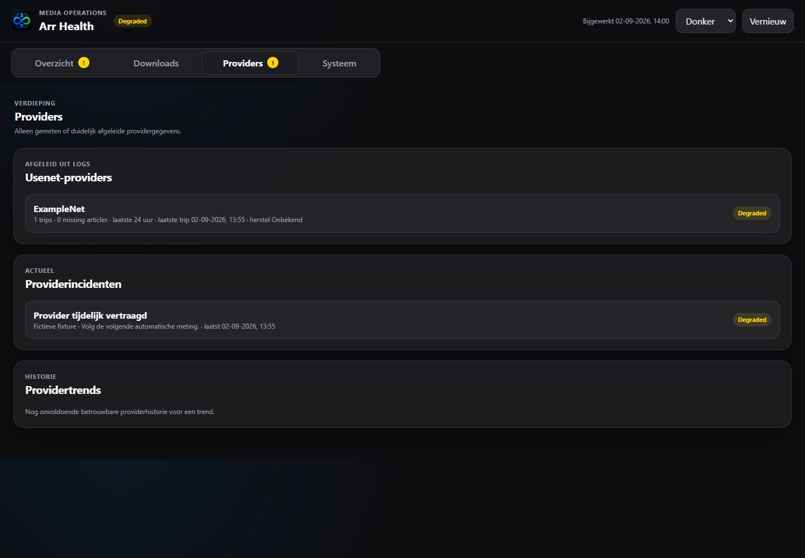

<div align="center">
  
  <h1>Arr Health Dashboard</h1>
  <p><strong>Eén rustige plek om te zien of je volledige mediaketen gezond is.</strong></p>
  <p>Sonarr · Radarr · InfiniDysk · WebDAV · Bazarr · Plex · Docker</p>

  
  
  
  
</div>

---

Arr Health is een privacyvriendelijk monitoringdashboard voor een self-hosted mediastack. Het combineert live API-controles, Dockerstatus, read-only mounttests en bestaande logs tot één menselijk antwoord:

> Is de keten gezond, waar ontstaat een probleem en moet ik nu iets doen?

Het dashboard draait volledig lokaal, gebruikt geen externe assets of chart-library en bewaart geen mediatitels in zijn metriekhistorie.

## Een dashboard dat helpt beslissen


Bovenaan staan vier compacte beslissingskaarten. Ze beantwoorden direct:

- **Algemene status** — gezond, degraded, incident of onbekend.
- **Queues** — normale downloads zijn blauw; alleen stalled of failed items vragen aandacht.
- **Providers** — dynamisch herkende providertrips en missing-article-signalen uit echte logs.
- **WebDAV-mount** — read-only beschikbaarheid, gemeten latency en werkelijk laatst succesvolle controle.

## Dark mode die ook echt rustig blijft


Light, dark en system/auto gebruiken dezelfde semantische statuskleuren. De handmatige keuze wordt lokaal onthouden en de pagina volgt bij een eerste bezoek automatisch het systeemthema, zonder zichtbare theme-flash.



| Kleur | Betekenis | Voorbeeld |
| --- | --- | --- |
| 🟢 Groen | Gezond of succesvol opgelost | Mount leesbaar, cutoff unmet = 0 |
| 🔵 Blauw | Normale activiteit | Actieve download of import |
| 🟡 Geel | Aandacht nodig | Queue-item tijdelijk zonder voortgang |
| 🔴 Rood | Actuele verstoring | API onbereikbaar, failed import, stale mount |
| ⚪ Grijs | Onvoldoende betrouwbare data | Provider nog niet in logs gezien |

## De hele mediaketen in beeld

```text
Sonarr / Radarr
       ↓
search / indexer → Usenet-provider → InfiniDysk → WebDAV-mount
                                                   ↓
                                      import / library → Plex / Bazarr
```

Per betrouwbaar controleerbaar onderdeel toont het dashboard bereikbaarheid, responstijd, laatste succesvolle controle en het actieve probleem. Hierdoor is niet alleen zichtbaar dát iets stuk is, maar ook waar de verstoring begint en welk vervolgonderdeel geraakt kan zijn.

## Belangrijkste mogelijkheden

### Vier gerichte hoofdtabbladen

De interface gebruikt vier hoofdtabbladen, zodat de dagelijkse controle compact blijft en technische details alleen zichtbaar zijn wanneer ze nodig zijn:

- **Overzicht** — beslissingskaarten, aanbevolen vervolgstap, actieve incidenten, mediaketen en belangrijkste trends.
- **Downloads** — Sonarr-, Radarr- en InfiniDysk-queues, wanted/cutoff unmet, repairs, periodic searches en downloadtrends.
- **Providers** — dynamisch aangetroffen providers, trips, missing articles, actieve providerincidenten en alleen bij voldoende historie een trend.
- **Systeem** — Dockercontainers, restart counts, API-bereikbaarheid, WebDAV-readchecks, dataverbruik, logs, servicelinks en handmatige acties.

De URL-hash is de route en maakt elk tabblad bookmarkbaar: `#overview`, `#downloads`, `#providers` en `#system`. Zonder of met een onbekende hash opent Overzicht. Terug/vooruit en refresh behouden de actieve context; een gewone tabwissel gebruikt de bestaande snapshot en doet geen extra API-request.

Algemene status, tabbadges, banner en aanbeveling gebruiken dezelfde server-side lijst met unieke actuele aandachtspunten. Normale downloadactiviteit blijft informatief en badgevrij; failed/stalled queues, providerincidenten, onbereikbare services, unhealthy of gestopte containers en mountproblemen tellen wel mee. Stabiele keys voorkomen eenvoudige dubbeltelling.

Het belangrijkste kritieke aandachtspunt verschijnt onder de globale navigatie als klikbare banner met bron en aanbevolen actie. Dit kan ook een failed queue, gestopte container of onbereikbare API zijn. De banner opent direct het passende tabblad en de relevante detailweergave. Zonder kritiek maar met een waarschuwing toont de aanbevelingskaart die waarschuwing; “Geen actie nodig” verschijnt alleen bij een lege aandachtspuntenlijst.

Op mobiel is de tabbar horizontaal scrollbaar en blijft de actieve tab in beeld. Met het toetsenbord werken Tab, Enter, Spatie, pijl links/rechts, Home en End. De tabs en panelen gebruiken de bijbehorende ARIA-rollen en relaties; badgetellingen zijn in de toegankelijke tabnaam opgenomen.

### Incidenten met een levenscyclus

Logsignalen krijgen een stabiele fingerprint, categorie, severity, first/last seen, telling en advies. Een oude foutregel blijft niet eindeloos rood:

- provider- en mountsignalen verlopen na 1 uur;
- importproblemen na 2 uur;
- missing/corrupt-signalen na 6 uur;
- replacement-limits na 12 uur;
- succesvolle repair- en fallback-events zijn direct opgelost.

Regels zonder betrouwbare timestamp worden veilig als historisch behandeld.

De operationele lifecycle wordt privacyvriendelijk vastgelegd in `incidents-history.json`. Actieve occurrences worden op hun fingerprint heropend, `firstSeen` blijft behouden en herstel verhuist een occurrence eerst naar **Opgelost** (72 uur) en daarna naar **Historisch**. Het bestand bevat geen logregels, paden, mediatitels, releasenamen of credentials en heeft dezelfde begrensde retentie als de metriekhistorie.

### Queue-aging in plaats van “queue = fout”

Een niet-lege queue is normale activiteit. Bron-specifieke adapters onderscheiden actief downloaden, wachten op import, stalled en expliciete fouten. Alleen geldige absolute starttimestamps leveren een leeftijd op; `timeleft` blijft uitsluitend ETA. Waar de brondata dit ondersteunt worden voortgang, resterende grootte, ETA en leeftijd getoond.

Queueproblemen gebruiken de bron-ID als stabiele identiteit en anders een eenrichtingshash van bron en genormaliseerde titel. Die hash wordt niet in metriekhistorie als mediatitel opgeslagen. De huidige logbronnen delen geen betrouwbare queue-ID, waardoor een queuefout en een inhoudelijk vergelijkbaar logincident afzonderlijk kunnen blijven; binnen iedere bron worden dubbele keys wel verwijderd. Dit vermijdt een onjuiste correlatie op basis van alleen een mediatitel.

Queueomvang is een neutrale activiteitstrend. Alleen de afzonderlijke probleemscore (failed/stalled queues, kritieke incidenten, onbereikbare services, mounts en containers) krijgt de interpretatie beter, stabiel of slechter.

### Read-only mountcontrole

De tv-, movie- en InfiniDysk-paden krijgen een echte directory-read met harde timeout. De controle schrijft nooit naar de media-mount en onderscheidt gezond, traag, time-out en ontbrekend.

### Privacyvriendelijke historie

`metrics-history.json` bevat alleen operationele totalen en statussen: queues, wanted/cutoff, incidentcategorieën, repairs, mountlatency, API-responstijden, probleemscore en containerstatus. `incidents-history.json` bewaart de geschoonde incidentlifecycle, mount-herstelstatus en de vorige container-restart counts. Writes zijn geserialiseerd en atomair. Standaard wordt iedere vijf minuten gemeten met 90 dagen begrensde retentie. Een ontbrekend of beschadigd bestand laat het dashboard niet crashen.

Mountreads draaien in een afzonderlijk killbaar Node-proces met een harde timeout en schrijven nooit naar de mount. Daardoor blijft de dashboardserver vrij wanneer een FUSE/WebDAV-read blijft hangen. Per mount blijven huidige meting, laatste succes, laatste fout en opeenvolgende failures zichtbaar, ook na een dashboardrestart.

Providerkaarten worden dynamisch afgeleid uit gelabelde gebeurtenissen binnen een expliciet venster van 24 uur. Bekende Viper- en Sunny-hostnamen worden leesbaar genormaliseerd; onbekende veilige hostnamen blijven zichtbaar. Missing articles alleen maken een provider niet down en verlopen trips houden de status niet onbeperkt degraded.

De Plex-weergave is bewust `Plex-container`: ze bewijst dat de geconfigureerde Dockercontainer draait, niet dat de Plex API of een end-to-end stream gezond is. Voor Bazarr worden container- en API-signalen eveneens afzonderlijk geïnterpreteerd.

## Techniek

```text
Browser
  └── static HTML / CSS / JavaScript
          │
          ▼
     Node.js 20 server
       ├── Sonarr / Radarr API
       ├── InfiniDysk queue en logs
       ├── Bazarr providers
       ├── Docker socket
       └── read-only mounts en logs
```

- Dependency-free Node.js 20-runtime.
- Geen database of buildstap nodig.
- Geen externe fonts, CDN’s of runtime-internetafhankelijkheid.
- Eén onbereikbare bron breekt de rest van het dashboard niet.
- Responsive, toetsenbordtoegankelijk en reduced-motion-vriendelijk.
- CSS/SVG-sparklines zonder zware chart-library.

## Lokaal starten

1. Kopieer de veilige voorbeeldconfiguratie:

   ```bash
   cp config.example.json config.json
   ```

2. Vul lokaal de API-keys en service-URL’s in. Commit `config.json` nooit.

3. Start met Node.js 20 of nieuwer:

   ```bash
   npm start
   ```

4. Open [http://localhost:8090](http://localhost:8090).

Tests uitvoeren:

```bash
npm test
```

## Unraid-deployment

De meegeleverde template staat in [`unraid/my-arr-health-dashboard.xml`](unraid/my-arr-health-dashboard.xml). De frontend is geen GitHub Pages-site: de Node-server communiceert met LAN-only services en mounted logs.

| Containerpad | Doel | Modus |
| --- | --- | --- |
| `/app` | Applicatie, configuratie, historie en actions | read/write |
| `/data` | Logs van de mediastack | read-only |
| `/symlinks` | Tv- en moviepaden | read-only |
| `/nzbdav` | WebDAV/InfiniDysk mount | read-only |
| `/var/run/docker.sock` | Containerstatus en allowlisted restarts | bindmount |

## Veilige beheeracties

Handmatige acties staan bewust onder een ingeklapt beheerblok. De backend accepteert alleen expliciet toegestane Arr-commands, host-actions en containers. Gelijktijdige acties worden geweigerd en cross-origin action requests worden geblokkeerd.

> [!IMPORTANT]
> Een read-only bindmount van de Docker-socket maakt de Docker API niet read-only. Houd het dashboard op een vertrouwd LAN en plaats er authenticatie via een reverse proxy voor wanneer het breder bereikbaar is.

## Repository-indeling

```text
server.js                 API-aggregatie, historie en veilige acties
lib/telemetry.js          status-, queue-, incident- en trendlogica
lib/mount-check.js        killbare read-only mountchecks en mountstate
lib/mount-check-worker.js geïsoleerde filesystem-read
public/index.html         semantische dashboardstructuur
public/app.js             rendering en interactie
public/dashboard-ui.js    clientfallback, tabs, badges en prioriteitsselectie
public/styles.css         responsive light/dark designsysteem
test/*.test.js            gerichte status-, lifecycle-, mount- en UI-regressietests
.github/workflows/ci.yml  Node.js 20-tests en syntaxchecks
config.example.json       veilige configuratietemplate
unraid/                   Unraid Docker-template
docs/                     README-screenshots
```

## Privacy

Commit nooit `config.json`, API-keys, dashboardexports, interne snapshots, volledige logs, media- of releasetitles en runtimehistorie. Deze bestanden zijn uitgesloten via `.gitignore`.
